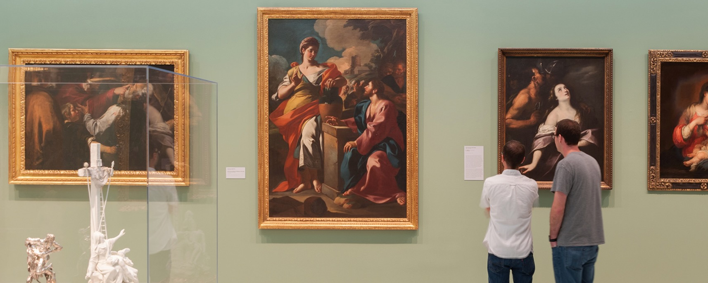

# ArtInsight Catalysts

ArtInsight Catalysts is a leading art market intelligence firm specializing in data-driven insights for museums, galleries, and collectors.

# Data Analysis

In Surge of recent public demands, ArtInsight Catalysts has identified a critical need for a comprehensive analysis of museum & paintings industry. 

Head of analytics team is in search of information on museums, paintings, artists, and the characteristics of individual paintings. This analysis aims to uncover patterns, trends, and insights that can inform museum management and public engagement strategies that can helpfull at ArtInsight.

Information in this analysis include:
- What Canva size is often the most expensive?
- Artist and their details that has the largest amount of paintings?
- Top 5 most popular artists?
- Identify the artist and the museum where the most expensive and least expensive painting is placed. Display the artist name, sale_price, painting name, museum name, museum city and canvas label
- ... and more

# Data

Dataset source : kaggle

Data files / tables :

- artist.csv
- canvas_size
- image_link
- museum_hours
- museum.csv
- product_size.csv
- subject.csv
- work.csv

# Approach

- Data Exploration
- Data Cleaning and Preparation
- Perform statistical analyses to identify significant relationships and trends.
- Visualize key findings using appropriate charts, graphs, and maps.
